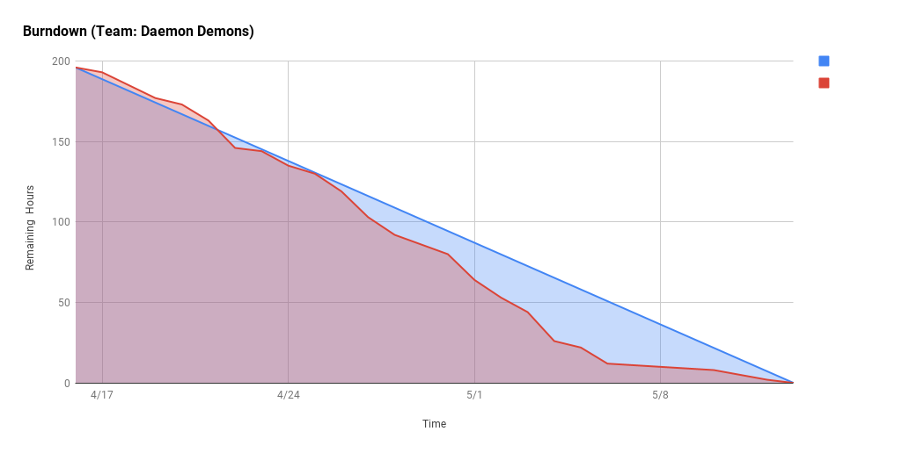
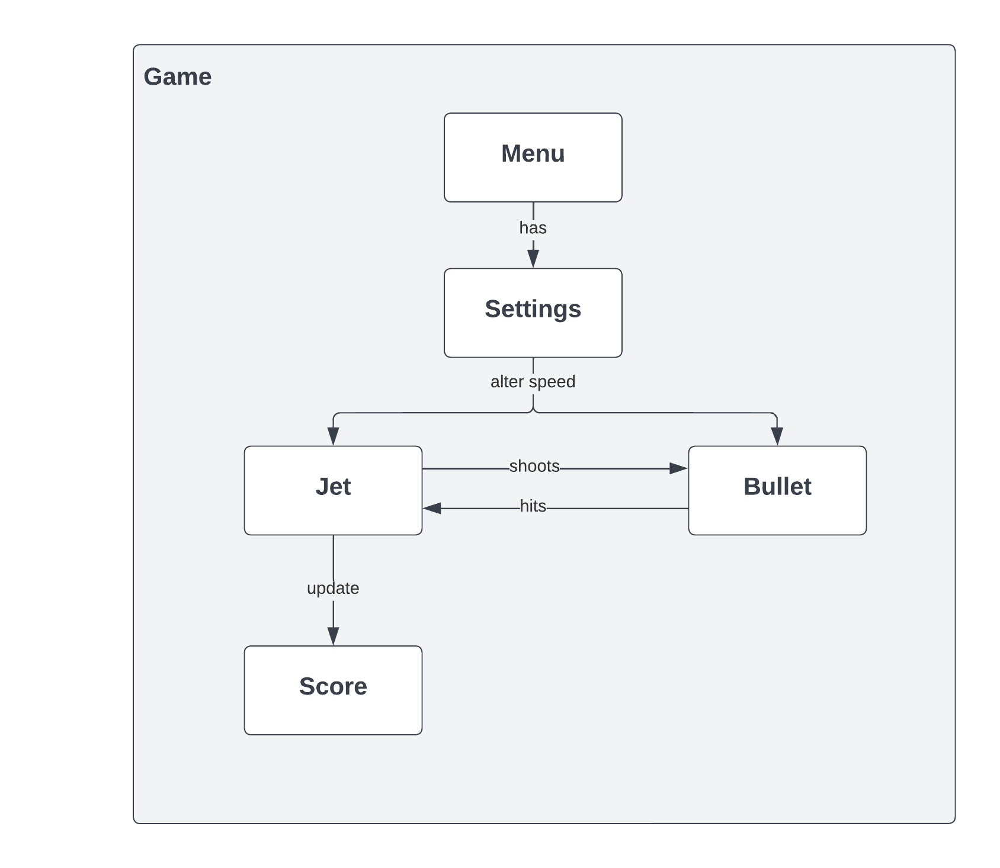
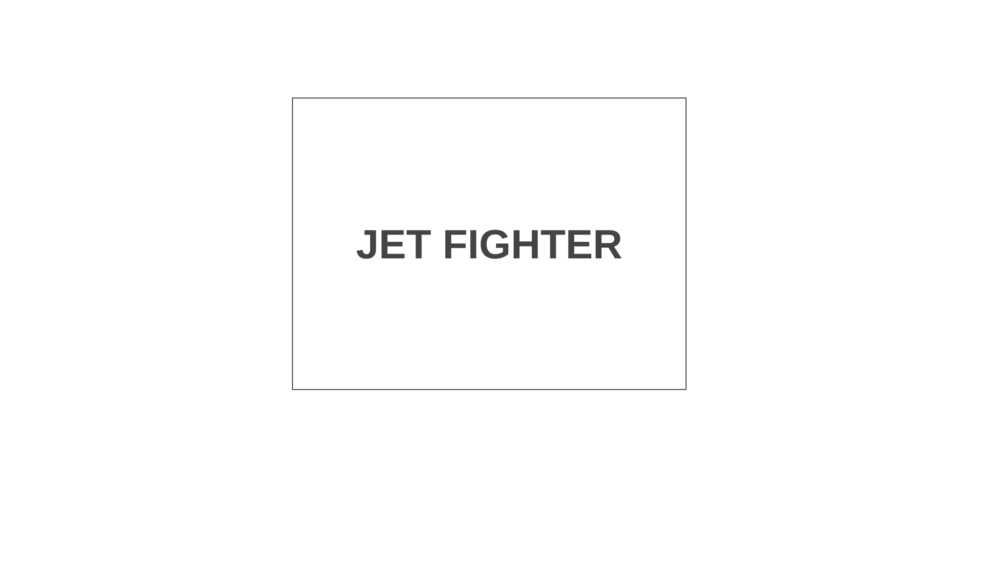
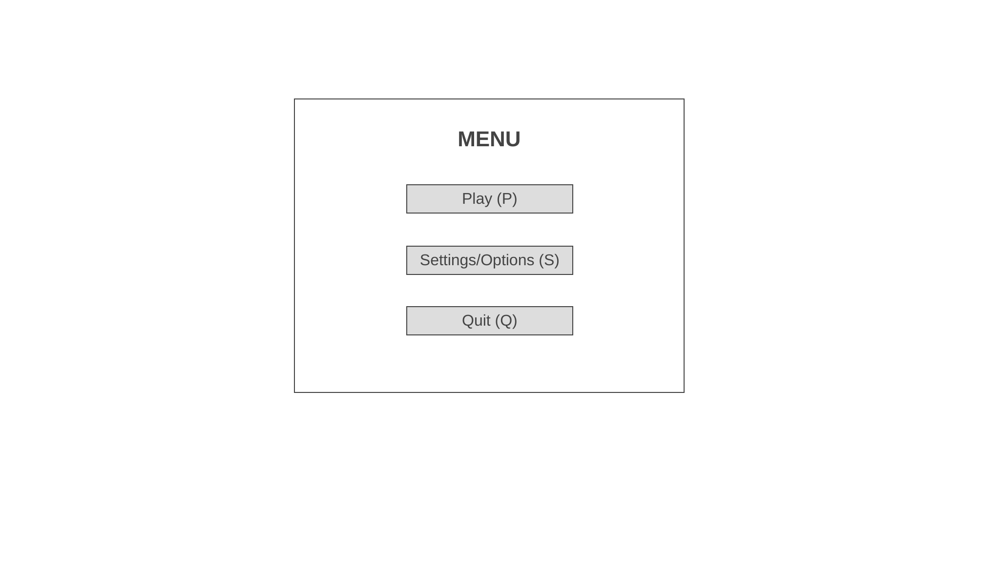
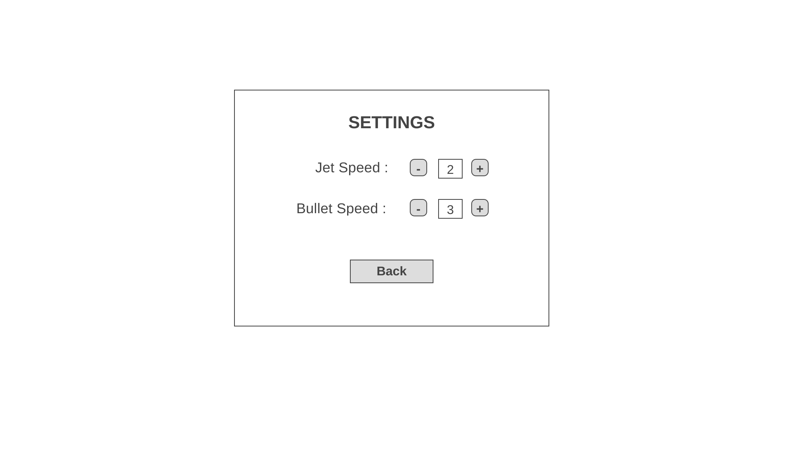
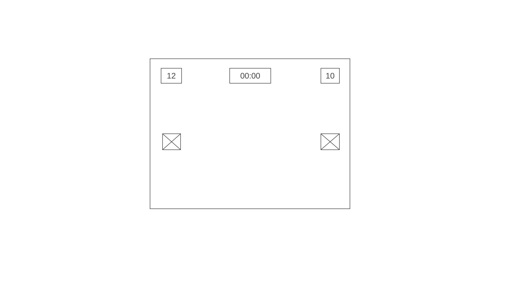
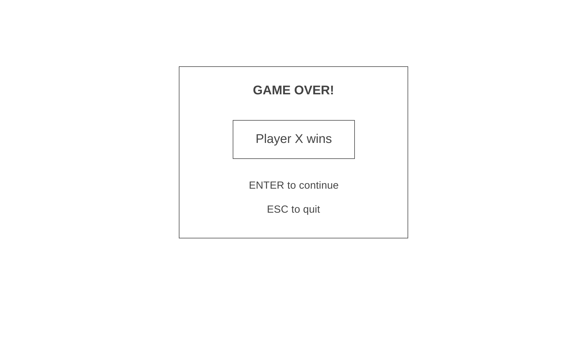

# Daemon Demons

## Members
Dylan Nguyen  
Puneet Tokhi  
Sandesh Gupta  
Shradha Yewale  

## Journals/Contributions
### Dylan Nguyen 
[Journal](./journals/dylan.md)  
Worked primarily on the jet and the bullet components. This involved movement, shooting, and overall behavior such as bullet fire rate and range. 
In addition, worked to create an easier means of detecting hits and updating score by generating subclasses of Jet and Bullet.
Implemented strategy pattern for the jet movement controls, with the different control schemes being different strategies.
### Puneet Tokhi 
[Journal](./journals/puneet.md)
### Sandesh Gupta 
[Journal](./journals/sandesh.md)
### Shradha Yewale 
[Journal](./journals/shradha.md)

## Videos

## Summary

## Key Features

## Task Sheet & Burndown
[Task Sheet](https://docs.google.com/spreadsheets/d/1RcyCSWCNy9yeMHt_llLNDZoZeZGewSY5GR5uJhFoxaU/edit?usp=sharing)  
  
Burndown chart finishes task before final date as the final week devoted to preparing for project submission and demo.

## Architecture Diagram

[Lucid chart](https://lucid.app/lucidchart/8a2b83f8-d4c5-4b58-b0b7-eb1032640ead/edit?invitationId=inv_16fc3e19-db7b-4333-bfc4-c52e307b5293)

## Wireframes

[Wireframes](https://wireframe.cc/pro/pp/02d102965543343)

| Screen  | Wireframe |
| ------------- | ------------- |
| Homescreen  |   |
| Menu  |   |
| Settings |  |
| Game |  |
| Post Game |  | 

