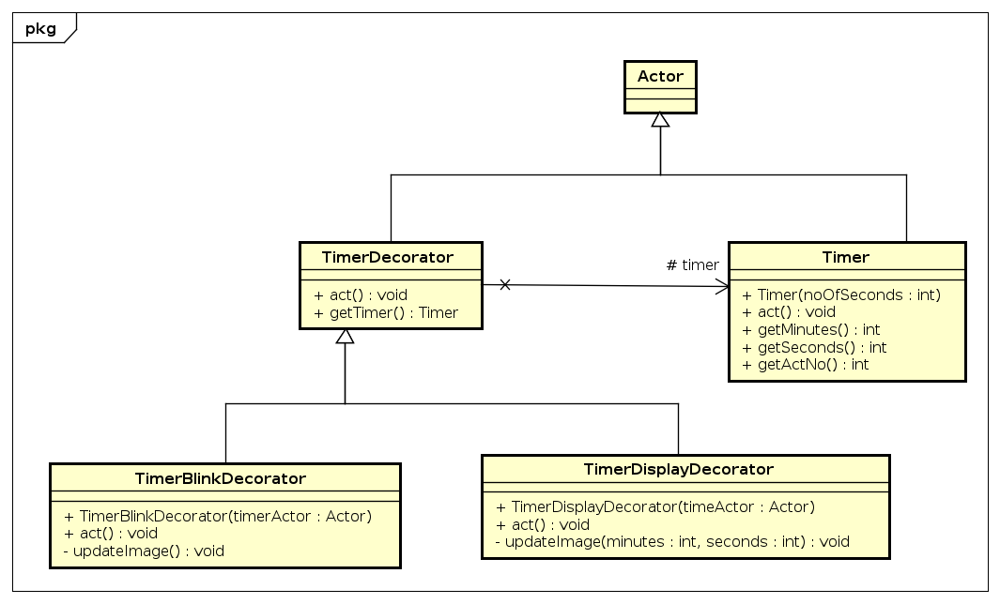

# Jet Fighter (Team Daemon Demons)

## Members
| Name          | Student ID    |  XP Core Value  |
| ------------- |---------------| --------------- |
| [Dylan Nguyen](https://github.com/DylanNguyenGit)  | 012615954     |  Respect       |
| [Puneet Tokhi](https://github.com/puneettokhi)      | 010904400     |  Communication     |
| [Sandesh Gupta](https://github.com/sandeshgupta)           |      |  Courage  |
| [Shradha Yewale](https://github.com/SHRADHA-YEWALE)      | 014725503     |  Feedback        |
 

## Summary
Jet fighter is a local multiplayer interactive Jet fighting game which takes us back to the 90s. Two players on the same keyboard control their own Jet and try to shoot bullets at the other jet. One person controls and maneuvers the Jet using the W, A, S, D keys while the other person uses the Arrow keys. Player 1 shoots the bullet using the `W` key while Player 2 shoots the bullet using the `Up` arrow key. The player who hits the maximum number of bullets within the specified time  wins the game. The game is developed using Java and Greenfoot from scratch.

### Instructions to run the project
* Install [Greenfoot](https://www.greenfoot.org/download)
* Clone the [repository](https://github.com/nguyensjsu/sp22-202-daemon-demons)
* Run `project.greenfoot` inside the `JetFighter` folder

## Videos
* [User Story Video](https://www.youtube.com/watch?v=WlVwUZLluek)  
* [Demo Video](https://www.youtube.com/watch?v=9OzpEX2Uu2Y)

## Gameplay Screenshots
### Title Screen

### Instructions Screen

### Menu Screen

### User Input

## Gameplay Screen

## Game Tied

## Winner Screen

## Key Features
* Player controlled Jets that turn and shoot
* A score and timer system that determines the winner of the game
* Game settings that allows players to change the speed of the bullets and jets

## Task Sheet & Burndown
[Task Sheet](https://docs.google.com/spreadsheets/d/1RcyCSWCNy9yeMHt_llLNDZoZeZGewSY5GR5uJhFoxaU/edit?usp=sharing)  

Burndown chart finishes task before final date as the final week devoted to preparing for project submission and demo.

## Project task board

  

## Design Patterns
### Strategy
  
Strategy pattern is implemented in order to handle different control schemes in the same class. In this case, an IMovementStrategy is made that 
handles moving, turning, and shooting. One strategy is for controllling with the arrow keys while the other is to use the WASD keys to control the jet. 
The Jet class has methods that define each strategy and picks the correct one depending ont he instantiation. 
The strategy is then called in the act method to respond to the corresponding button presses.

### Command

Command Pattern is used to add action listener to any button that is present in the game. In our project, the `MenuOption` class implements the `IMenuInvoker` interface so that when the `invoke()` method is called, the `MenuOption` performs some action added in the command that is attached to the button. In this case, we are creating buttons from the `Buttons` class which adds an inline receiver to `IMenuCommand` and attaches the command to the created button. There are two hash maps used in the `Buttons` class, one is for the menu option commands, and the other is for menu option images.

### Observer

Observer pattern is a design pattern in which a subject notifies an object automatically of any state change usually by calling their methods. Observer Pattern is used to update and display the players score. Here `IDetectSubject` is a subject interface with `notifyObservers()` and `Jet` class(acts as subject) implements it. The `Jet1` and `Jet2` class extends the Jet class to implement the `notifyObservers()`. When the hit is detected, that is when Jet1 hit by Bullet2, jet 2 score is updated and when Jet2 hit by Bullet1, jet 1 score is updated. 

`IUpdateScoreObserver` acts as an object interface. Score (acts as object) which implements `updateScore()` to update the score when there is a detect hit(state change) in `Jet1` and `Jet2`. `JetOneScore` will update the Jet1 score when Jet2 hits by Bullet1 and `JetTwoScore` will update the Jet2 score when Jet1 hits by Bullet2.

### Decorator

* `Decorator` pattern is used to display the timer on the game screen.  
* `Timer` class implements the logic to run timer that updates the time every second.
* `TimerDecorator` defines the structure for decorators and implements _Actor_ class.
It has default method `act()` for displaying the time. 
* `TimerDisplayDecorator` implements the functionality that converts the time in `MM:ss` format. It also formats the timer text fonts and color for display. 
* `TimerBlinkDecorator` implements the functionality that blinks the timer text as the game nears completion. The time at which the timer starts blinking can be configured in `GameConfig` class.

## Architecture Diagram

## Deployment Diagram

## Class Diagram

## Wireframes

| Screen  | Wireframe |
| ------------- | ------------- |
| Homescreen  |   |
| Menu  |   |
| Settings |  |
| Game |  |
| Post Game |  | 

## Journals/Contributions

| Name  | Design Pattern |
| ------------- | ------------- |
| Dylan Nguyen  | Strategy |
| Puneet Tokhi  | Command  |
| Sandesh Gupta | Decorator|
| Shradha Yewale | Observer, Singleton|

### Dylan Nguyen 
[Journal](./journals/dylan.md)  
* Worked primarily on the `Jet` and the `Bullet` components. This involved movement, shooting, and overall behavior such as bullet fire rate and range. 
* Made the `Jet` class available to alteration for different settings 
* Made subclasses `Jet1`, `Jet2`, `Bullet1`, and `Bullet2` to make hit detection and score updates easier.
* Used `Strategy Pattern` with `IMovementStrategy` to make the different control schemes of arrow keys and WASD.
* Made Demo video

### Puneet Tokhi 
[Journal](./journals/puneet.md)
* Worked on implementing the `Title`, `Menu`, `Instructions`, `Settings` and `GameSettings` screen
* Implemented the `Explosion`, `Logo` and `Instructions` class and added code to animate the game background to provide a dynamic background effect
* Used the `Command Pattern` to implement the `Menu` and `Settings` screen. Created `Buttons` and `MenuCommand` class and required invoker and receiver interfaces to implement the Command Pattern. All buttons used in the game are in `Buttons` class and the command pattern is used to assign functionality to buttons and labels.
* Added game assets including the title screen, background music, explosion sound, bullet sounds and the menu navigation sounds and also designed the game's logo
* Created the `Player` class to get the Player's information from the user when the game is started 
* Added the `Jet` and `Bullet` speed configurations in the settings screen, fixed score display bug, and updated the `WinnerBanner` class to enhance user experience
* Worked on the project documentation and class diagrams and added code for the game's `Title` screen
* Helped the team with the user story video ideas and assisted in editing and creating the video montage

### Sandesh Gupta 
[Journal](./journals/sandesh.md)

* Worked on creating `Assets`, `Timer`, `Settings` and `Post-game` screen.
* Assets
  * Create Jet and Bullet asset. 
  * Integrated the assets with gameplay.
* Timer
  * Implemented the timer logic
  * Display timer in game
  * Timer blink when game is about to end
  * Implemented Timer using Decorator design pattern
* Settings
  * Add functionality for increment and decrement of speed in Settings screen
  * Reflect speed changes in gameplay
  * Vaidation of speeds: Min, max and Jet speed < Bullet speed
* Post-game screen
  * Designed and implemented the post-game screen with the game results.
* Documentation 
  * Architecture diagram
  * Class diagram 
  * UI wireframes
  * User strory video

### Shradha Yewale 
[Journal](./journals/shradha.md)

* I primarily worked on the Score feature for `Jet1` and `Jet2`.
* Used an `Observer Pattern` to implement the score feature.
* Implemented major functionalities such as Detect Hit, Update Score, Display Score and Reset Score in score feature.
* `Detect Hit` : Detect the hit for `Jet1` with `Bullet2` and `Jet2` with `Bullet1` to notify about the hit to update score.
* `Update Score` : Once the hit is detected updated the score in JetOneScore and JetTwoScore
* `Display Score` : `JetOneScoreDisplay` and `JetTwoScoreDisplay` to display the score. worked on display score design and layout on screen.
* `Reset Score` : Whenever the game is finished and a new game is started the score is resetted to 0.
* Implemented Singleton design pattern for `JetOneScore`, `JetTwoScore`, `JetOneScoreDisplay` and `JetTwoScoreDisplay`.
* Actively participated in discussions right from game selection, tasks identification, feature distributions, patterns to implemented, scrum meeting and implemented feedback core value.
* Worked on project documentation of the project. Draw the class diagram for the observer design pattern. Also made a deployment diagram for the project.
* Contributed in making the user video for Jet fighter, .

